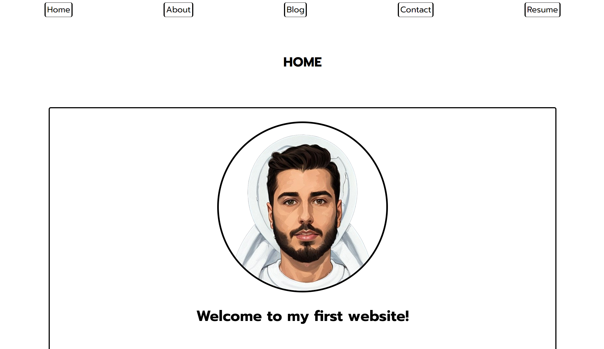
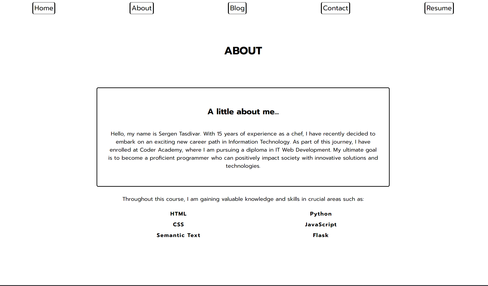
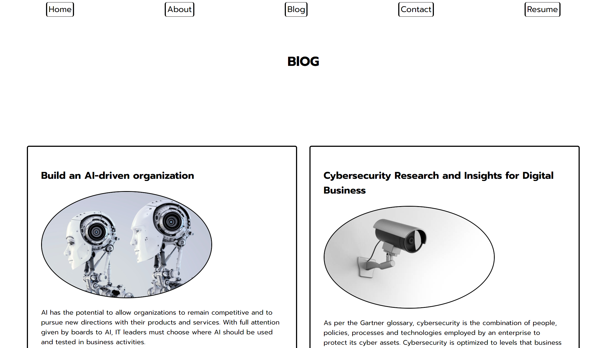
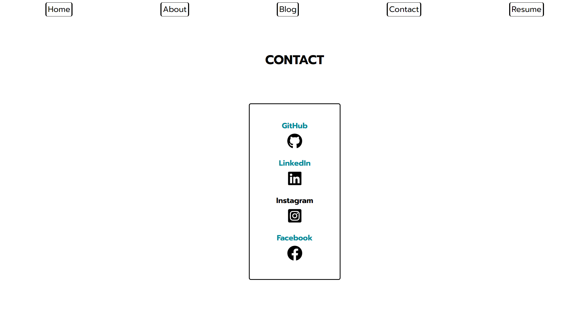
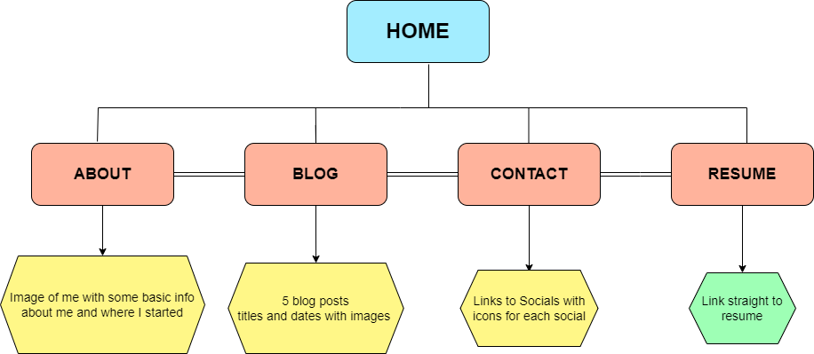

# **Sergen Tasdivar**  
**T1A2**

**https://github.com/Sergen1993/SergenTasdivar_T1A2.git**  

**12 April 2023**  

## My Portfolio

The portfolio allows employers to get a sense of who I am and what I can bring to their team. It also allows employers to easily access samples of my work and see the type of quality I produce. It provides the opportunity to demonstrate my knowledge and experience in a way that a resume or cover letter cannot. My portfolio is a representation of my professional brand and is a great way for employers to get to know me better. 

The easy user interface and functioning nav bar allow users to find what they are looking for quickly and easily. The portfolio is also mobile friendly, so users can access it on the go. The contact links make it easy for users to get in touch with me, while the "about'' section and blog provide more in-depth information about me and my work. By providing the resume link, employers can easily view my work experience and qualifications, as well as my skill set, which is important for a position in IT or DEV. This gives them a clearer picture of my capabilities and qualifications for the job.

The screenshots above show a sample of my portfolio, where each page is illustrated with a screen shot.

I mapped out the pages I wanted to include, their content, and the navigation I wanted to use (refer to image below). I also considered the user experience, making sure the navigation was intuitive and easy to use. Finally, I began creating the actual portfolio.

This portfolio has been built using: 
* HTML
* CSS
* Font Awesome
* Vercel
* GitHub
* Google Fonts  

I used Vercel for hosting and deployment, and Google Fonts for custom fonts. I also included some features from Font Awesome to make the site more visually appealing. I also used GitHub for version control and tracking progress. Finally, I used HTML and CSS for the overall structure and design of the portfolio.
